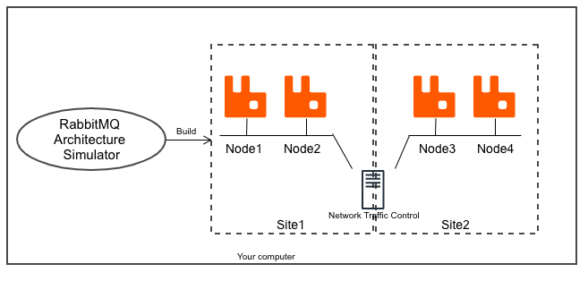

# RabbitMQ Architecture simulator
This project helps RabbitMQ architects to design both RabbitMQ server and AMQP related architecture design.

## Objective:
This project aim to provide a dockerized environment to simulate different topology of RabbitMQ server deployment.
For example: Multi-Site RabbitMQ deployment with latency across 2 sites.

Everything will be running as docker containers, and is designed to rapidly spawn up and down all components.

This simulator is useful for:
1. Testing change/settings `rabbitmq.conf` rapidly
2. Behavior monitoring: Deliberate kill / overload / OOM an instance of RabbitMQ server, backpressure in extreme cases
3. Benchmarking for the impact of variables hard to modify in real life: Network latency, packet loss, CPU and RAM bounded

Of course by benchmarking it's not mean for running production level benchmarking but as a baseline/reference benchmarking on
cases such as: 
1. If I use publish confirm, how much latency it will increase vs without publish confirm?
2. Will message drop/loss occur when a RabbitMQ server is lost
3. Development use in your app for transaction critical section turning

## Anti-Goals:
1. Intended for production use
2. For real/native throughput / performance benchmarking
3. Replacing [RabbitMQ Simulator](https://github.com/RabbitMQSimulator/RabbitMQSimulator) 

## What is the difference of Architecture Simulator vs RabbitMQ Simulator?
[RabbitMQ Simulator](https://github.com/RabbitMQSimulator/RabbitMQSimulator) Simulate the Exchanges + Queue + Binding interaction with consumer and producer.

This repo [RabbitMQ Architecture Simulator](https://github.com/hinyinlam/rabbitmq-architecture-simulator) simulate the RabbitMQ server itself, such as forming Cluster in a multi-site deployment.

